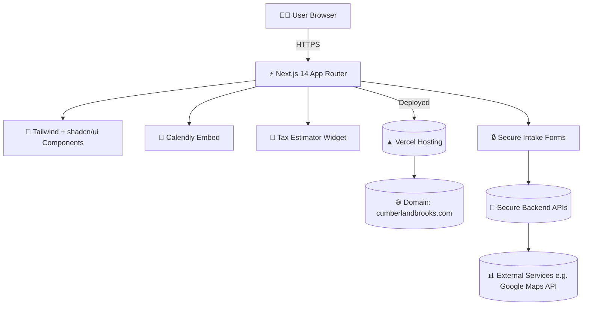

# ⚖️ Cumberland Brooks, LLC – Web App  

  
  
  
  

> **Modern client-first platform for Cumberland Brooks, LLC** – expert negotiators delivering **real savings with zero upfront fees**.  

Built with [Next.js](https://nextjs.org), [Tailwind CSS](https://tailwindcss.com), and [shadcn/ui](https://ui.shadcn.com).  

---

## 🌟 Key Features

- ⚡ **Next.js 14 App Router** + TypeScript  
- 🎨 **Tailwind CSS** + polished shadcn/ui components  
- 📱 **Responsive** mobile-first design  
- 🔒 Secure intake forms (**HIPAA / PCI aware**)  
- 📅 Seamless **Calendly booking** integration  
- 🧾 Address-based **property tax estimator widget**  
- 🧩 Modular pages (Services, Results, About, Contact, Team)  
- 💡 SEO-optimized with **OpenGraph + Schema.org**  

---

## 🖼️ Product Showcase

| Home Page | Services Page | Contact Form |
|-----------|---------------|--------------|
|  |  |  |

*(Add your own screenshots inside `/docs/screenshots/` to bring this section alive.)*

---

## 🏗️ Tech Stack Diagram



> Visual of how **users interact** with the app → rendered by Next.js → deployed on Vercel → powered by secure APIs + integrations.

---

## 🚀 Getting Started

Clone repo & install dependencies:

```bash
git clone <your-repo-url>
cd your-repo
pnpm install
# or npm / yarn / bun
```

Run locally:

```bash
pnpm dev
```

Visit 👉 [http://localhost:3000](http://localhost:3000)

Edit `app/page.tsx` (or any route in `app/`) → browser auto-reloads.

---

## 🛠️ Project Structure

```
src/
 ├─ app/               # Next.js routes
 │   ├─ services/      # Service pages
 │   ├─ results/       # Case wins & outcomes
 │   ├─ about/         # About & mission
 │   ├─ contact/       # Contact form + Calendly
 │   └─ layout.tsx     # Navbar + TrustBar + Footer
 ├─ components/        # Shared UI
 │   ├─ Navbar.tsx
 │   ├─ Footer.tsx
 │   ├─ TrustBar.tsx   # Rotating trust messages
 │   └─ CTASticky.tsx
 └─ styles/            # Global Tailwind overrides
```

---

## 📦 Deployment

Deploy on [Vercel](https://vercel.com) in seconds:

1. Push repo → GitHub  
2. Import into Vercel  
3. Add env vars (e.g. Google Maps API key)  
4. Click **Deploy** 🚀  

📖 Docs: [Next.js Deployment Guide](https://nextjs.org/docs/app/building-your-application/deploying)

---

## 📚 Resources

- [Next.js Docs](https://nextjs.org/docs)  
- [Learn Next.js](https://nextjs.org/learn)  
- [shadcn/ui](https://ui.shadcn.com)  

---

## 👥 Contributors

- **Narasimha Reddy Putta** (Lead Developer)  
- Open to PRs & Issues 💡

---

## 🏛️ About Cumberland Brooks, LLC

We help clients **cut medical bills, reduce property taxes, and resolve collections**.  
Our model: **you only pay when we save you money**.  

👉 [📅 Book a Free Consultation](https://calendly.com/narasimhareddyputta999/15min)

---

✨ Built with precision, clarity, and relentless advocacy.  
 